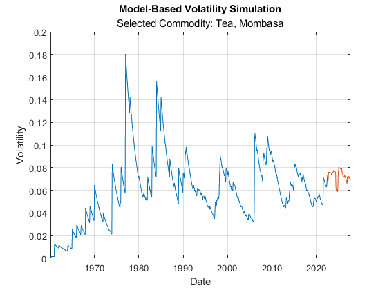

# Commodity Volatility Modelling

  

Modelling and forecasting volatility is a common task in many financial applications. This collection of examples analyzes, models, and forecasts the volatility associated with a collection of soft commodities.

Soft commodities are impacted by uncertainties associated with both short and long-term changes in weather patterns caused by climate change. As these uncertainties increase, we expect volatility modelling to increase in importance as practitioners seek to improve their forecasts of market responses to the impacts of climate change.

The examples in this collection are designed to showcase a range of statistical methods, machine learning techniques, and time-series models which are broadly applicable in the volatility modelling area.

The examples were developed by Phoebe Piercy and Ken Deeley at MathWorks.

## Installation and Getting Started
The examples are provided in a MATLAB project.
1. Double-click on the project archive (the .mlproj file) to extract the project.
2. The example files are the live scripts within the project.
3. The examples rely on external commodity data provided by the World Bank. The example file `S01_DataProcessing.mlx` downloads this data, and requires an internet connection.

### [MathWorks&reg;](https://www.mathworks.com) Product Requirements

These examples were developed for MATLAB release R2022b or later.
- [MATLAB&reg;](https://www.mathworks.com/products/matlab.html)
- [Statistics and Machine Learning Toolbox&trade;](https://www.mathworks.com/products/statistics.html)
- [Econometrics Toolbox&trade;](https://uk.mathworks.com/products/econometrics.html)

## License
The license for this entry is available in the [license.txt](license.txt) file in this GitHub repository.

Copyright 2022 The MathWorks, Inc.

## Community Support
[MATLAB Central](https://www.mathworks.com/matlabcentral)