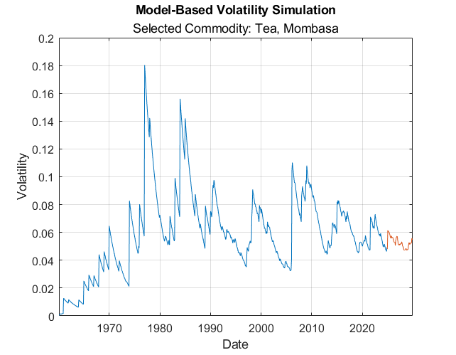

# Commodity Volatility Modelling

Modelling and forecasting volatility is a common task in many financial applications. This collection of examples analyzes, models, and forecasts the volatility associated with a collection of soft commodities.

Soft commodities are impacted by uncertainties associated with both short and long-term changes in weather patterns caused by climate change. As these uncertainties increase, we expect volatility modelling to increase in importance as practitioners seek to improve their forecasts of market responses to the impacts of climate change.

The examples in this collection are designed to showcase a range of statistical methods, machine learning techniques, and time-series models which are broadly applicable in the volatility modelling area.

The examples were developed by Phoebe Piercy and Ken Deeley at MathWorks.

## Installation and Getting Started
The examples are provided as a [MATLAB toolbox](https://www.mathworks.com/help/matlab/matlab_prog/create-and-share-custom-matlab-toolboxes.html).
1. Download the toolbox installer (the `Commodity_Volatility_Modelling.mltbx` file) from the `Releases` section on GitHub.
2. Double-click on the `Commodity_Volatility_Modelling.mltbx` file to install the toolbox.3. 
3. The example files are the following live scripts.
   - `S01_DataProcessing`: This script imports and processes the data for subsequent modelling.
   - `S02_TrendDecomposition`: This script clusters the commodities based on trend analysis.
   - `S03_NonParametricVolatility`: This script performs nonparametric volatility estimates and further clustering on the commodities.
   - `S04_ModelBasedVolatility`: This script forecasts volatility using time-series models for the principal components of the volatility.
4. The examples rely on external commodity data provided by the World Bank. The example file `S01_DataProcessing` downloads this data, and requires an internet connection.

### [MathWorks&reg;](https://www.mathworks.com) Product Requirements

This example requires MATLAB R2025a or a later release.
- [MATLAB&reg;](https://www.mathworks.com/products/matlab.html)
- [Statistics and Machine Learning Toolbox&trade;](https://www.mathworks.com/products/statistics.html)
- [Econometrics Toolbox&trade;](https://www.mathworks.com/products/econometrics.html)
- [Datafeed Toolbox&trade;](https://www.mathworks.com/products/datafeed.html)
- [Optimization Toolbox&trade;](https://www.mathworks.com/products/optimization.html)
- [Financial Toolbox&trade;](https://www.mathworks.com/products/finance.html)

## License
The license for this entry is available in the [license.txt](license.txt) file in this GitHub repository.

Copyright 2022-2026 The MathWorks, Inc.

## Community Support
[MATLAB Central](https://www.mathworks.com/matlabcentral)